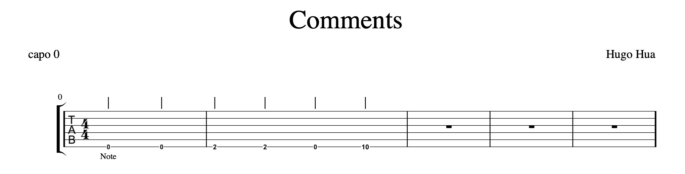
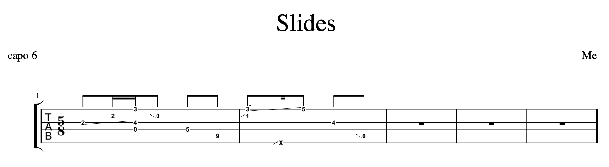

# Create Guitar Tabs

With a simple syntax, blueberry lets you focus on the music, and not on annoying UIs! Blueberry comes with two modes: score mode and tab mode. Score mode is used to create guitar tablature for fingerstyle playing, while tab mode is used to create more traditional guitar tabs, with lyrics, chord charts, and chord placements.

&nbsp;


&nbsp;

* TOC
{:toc}

&nbsp;

# Usage

In order to run the program, you need to have [.NET](https://dotnet.microsoft.com/) and [Ghostscript](https://www.ghostscript.com/) installed. Follow the instructions for downloading and setup.

## Mac

Download the packages above and clone this repo into an easily accessible location.

### Running Within the Blueberry Folder

1. The quickest way to run the program is directly in the cloned repo. Open terminal, and navigate to the lang folder within blueberry.

   ```shell
   cd path-to-folder/blueberry/lang
   ```

2. Create a new file to write your code in. I suggest using the .blb extension for ease-of-use, but any extension works.

3. Run using dotnet. It will create a .ps file with the specified name.

   ```shell
   dotnet run <mode> <filename> <output filename>
   ```

4. Use ps2pdf, a command line tool from Ghostscript, to convert the postscript file to a pdf. If you get an error, you may need to add ghostscript to your PATH variable.

   ```shell
   ps2pdf -dNOSAFER <file>.ps
   ```
### Running From Separate Folder

1. To run the program on files in a separate folder, I suggest writing a custom script to do the job for you. Follow [this link](https://medium.com/devnetwork/how-to-create-your-own-custom-terminal-commands-c5008782a78e) for instructions on how to set up a file with custom scripts. Once created, add the following, replacing PATHTOFILE with the path to wherever you cloned the blueberry folder:

   ```shell
   function pspdf() {
      ps2pdf -dNOSAFER $1.ps
      open $1.pdf
   }

   function blbscore() {
      if [[ "$#" == 0 ]]; then
      echo 'Usage: blbscore <file with code> <name of output file>'
      return 0
      fi
      if [ -z "$2" ]
        then
            OUTFILE='score'
      else
        OUTFILE=$2
      fi
      cwd=$(pwd)
      cd ~/PATH_TO_REPO
      dotnet run score $cwd/$1 $OUTFILE
      pspdf $OUTFILE
      rm $OUTFILE.ps
      mv $OUTFILE.pdf $cwd
      cd $cwd
   }

   function blbtab() {
      if [[ "$#" == 0 ]]; then
      echo 'Usage: blbtab <file with code> <name of output file>'
      return 0
      fi
      if [ -z "$2" ]
      then
      OUTFILE='tab'
      else
      OUTFILE=$2
      fi
      cwd=$(pwd)
      cd ~/PATH_TO_REPO
      dotnet run tab $cwd/$1 $OUTFILE
      pspdf $OUTFILE
      rm $OUTFILE.ps
      mv $OUTFILE.pdf $cwd
      cd $cwd

   }
   ```
Now, you can create files anywhere on your computer, and run it using `blbtab <filename> <outputFile>` or `blbscore <filename> <outputFile>`!

## Windows

Download the packages above and clone this repo into an easily accessible location. In addition, make sure you have [Virtual Studio Code](https://code.visualstudio.com/).

The instructions for running within the blueberry folder should be the same as for Mac users. Use the terminal function within VsCode. In addition, check out this [post](https://stackoverflow.com/questions/6011373/call-ghostscript-in-windows-by-its-invocation-name#:~:text=Open%20a%20cmd%20window%20and,64%20bit%20Windows) for how to use the ghostscript functions in the terminal. I'm not familiar with scripting on Windows and how to create a script to run the program from other folders.

# Score-Mode Documentation

## Basic Syntax

   ```   
   -title Example
   -composer Person
   -key c
   -time 4-4
   -capo 1

   1:
      1f4/sls
      3g#
      5d8/sli
      (5f 6x)8
      4e4/sle
   2:
      2e16
      <2f#16 3g16 4g16/har>8
      2a16
      6bb2
      1f8/gra
      2a4
   ```


Each file begins with options that control certain aspects of the tab. They begin with a `-`, followed by the option name, and the chosen parameter. Next, each measure begins with the measure number, a colon, and the notes on separate lines with a tab (or at least a space).

## Options

Here are the valid options:

   ```
   -title Blueberry
   -composer Hugo Hua
   -arranger Unknown
   -key d#m
   -time 4-4
   -capo 2
   -tuning E-A-D-G-B-E
   ```

The title, arranger, and composer can be whatever you choose, and the capo is an integer.

### Key

Valid keys are:

* c
* cm
* c#
* c#m
* cb
* d
* dm
* db
* d#m
* e
* em
* eb
* ebm
* f
* fm
* f#m
* f#
* g
* gm
* g#m
* gb
* a
* am
* a#m
* ab
* abm
* b
* bm
* bb
* bbm

Notes that are entered will be automatically changed based on the key chosen.

### Time

Time signatures are of the format `<top>-<bottom>`. The first number can be a number between 1-32, or 64, and the second number can be 1, 2, 4, 8, 16, 32, or 64.

## Notes and Rests

There are several basic note types: single notes, rests, groups, and tuplets.

Single notes follow the format `<string number><pitch><OPTIONAL rhythm><OPTIONAL properties>`. Here are some examples:

   ```
   1e4
   5f#/gra
   6x8../gra/slu
   ```

Rests follow the format `r<OPTIONAL rhythm>`

   ```
   r
   r8
   r16..
   ```

Grouped notes allow for multiple notes to be played at the same time. They follow the format `(<note>+)<OPTIONAL rhythm><OPTIONAL group-properties>` where `<note>` is composed of `<string number><pitch><OPTIONAL group-member-properties>`. I know, it looks crazy, but it's not that bad! Properties work differently with grouped notes, because some properties must be applied to an individual note within the group, while others are applied to the entire group. See the [properties](https://blueberry.hugohua.com/#properties-for-grouped-notes) section for more info.

   ```
   (1e 2e 3e)4
   (4f#/har 6dn)16/gra
   (3dn 4fb 6x/par)
   ```

Tuplets allow for more complex rhythms and syncopation. They follow the format `<<note>+><rhythm>`, where `<note>` is a single note, group note, or rest. The rhythm at the end denotes the total rhythm of the entire tuplet. Note that the final rhythm is _required_ for tuplets.

   ```
   <4d8 2f16>4
   <6d r 1f (5f 3d)>8
   <1f#8/har 2dn4/par/sli/sls (4f#/sld 1x/har)16./gra/sle>32.
   ```

### Pitch

The following are valid pitches:

* c
* c#
* cb
* cn
* d
* d#
* db
* dn
* e
* e#
* eb
* en
* f
* f#
* fb
* fn
* g
* g#
* gb
* gn
* a
* a#
* ab
* an
* b
* b#
* bb
* bn
* x

Notes with an `n` are natural notes, which differ from regular notes in that the key signature will not change them. The `x` represents a percussive note rather than a pitch; it shows up as an "X" rather than a fret number. Using the pitches, key signature, and capo, the program calculates the fret for that note on the given string. The default is the lowest possible fret, but there is a property that can raise frets, which will be explained in the [properties](https://blueberry.hugohua.com/#properties) section.

### Rhythm

Rhythms are denoted with a number after the pitch.

  0 = full measure (only for rests)
- 1 = whole note
- 2 = half note
- 4 = quarter note
- 8 = eighth note
- 16 = sixteenth note
- 32 = 32nd note
- 64 = 64th note

Dots `.` can also be added after the number. The limit is 3 dots for notes of an 8th note or longer, 2 dots on a 16th note, 1 dot on a 32nd note, and no dots are allowed on a 64th note. Rhythms are optional; if omitted, the note will have the same rhythm as the previous note. The default for the first note on the page is one unit of the given time signature. Note: the 0 rhythm can only be used for rests. r0 denotes an empty measure. Another node: if you label a measure as measure 0, it can have less than the required number of beats. This allows for pick up notes at the beginning of the piece.

## Comments

Comments can be added in between any notes using the $ symbol. The comment must begin with and end with a $. It will appear directly underneath the note that came before the comment. In addition, hidden comments can be written using the % symbol. These can be written anywhere in a measure, as well as in between measures, and will not appear anywhere in the tab.

   ```
   -title Comments
   -time 4-4
   -key c
   -composer Hugo Hua

   % hello %
   0:
      1e
      $Note$
      1e
   1:
      %Hidden comment%
      1f#4
      1f#
      1e
      1d
   ```



## Properties

Properties allow for symbols, articulations, and customization. This section details all the valid properties.

All properties begin with a `/` and consist of 3 letters, except `^`, which is the property for pushing a note up to the next possible fret position for that note.

### Grace Notes

Grace notes are defined with the `/gra` property. They are otherwise written in the exact same way as regular notes, except that their rhythm will not count towards the measure's entire rhythm.

   ```
   -time 2-2
   -capo 6
   -key ab
   -title Grace Notes
   -composer Me

   1:
      1f4
      (3d 5fn)4
      4g16/gra
      3e8
      2a
      6f4
   2:
      (1e 2f 4g)8/gra
      4x16/gra
      5cb/gra
      <3f4 5g4 (3a 4f)4>2
      3d2
   ```


### Slurs

Slurs are drawn using the `/sls` - slur start - and `/sle` - slur end properties. Each starting slur must be matched with an ending slur on a note further in the tab. Any un-ended slurs will cause an error. In addition, slurs cannot cross; a started slur must be ended before a new one is started.

   ```
   -time 3-4
   -capo 4
   -key f#m
   -title Slurs
   -composer Me

   1:
      3d/sls
      4fn/sle
      5g8/sls
      3a
   2:
      1f#4
      5x
      3d16
      4a8
      6c16/sle
   ```


### Hammer On/Off

Hammer notes look like ties, but don't have to be between the same note. They are defined by `/ham`

   ```
   -title Hammer
   -time 4-4
   -key c
   -composer Hugo Hua

   1:
      1e
      1e8
      1f#/ham
      1g#4
      1e
   2:
      2b
      2a8/ham
      2b16/ham
      2a16
      1g#2
   ```


### Palm Mute

A single note palm mute can be written with `/plm`. It adds a little 'PM' underneath the note.

   ```
   -title Palm Mute
   -time 4-4
   -key c
   -composer :D

   1:
      1f#/plm
      3e8
      1f#
      6g#4
      5d
   2:
      2b
      2a8/plm
      3f#2/plm
      1g16
      5ab16
   ```


### Longer Palm Mute

If you have a palm mute that lasts for a while, instead of typing `/plm` for each note, use `/pl1` and `/pl2` for the start and end of a longer palm muted section.

   ```
   -title Palm Mute
   -time 4-4
   -key c
   -composer :D

   1:
      1f#
      3e8/pl1
      1f#
      6g#4
      5d
   2:
      2b
      2a8/pl2
      3f#2
      2f16/gra/pl1
      1g16
      5ab16/pl2
   ```


### Plucked Notes

Plucked Notes can be either up `/plu` or down `/pld`. It draws the squiggly line often used in fingerstyle playing.

   ```
   -time 3-4
   -capo 4
   -key f#m
   -title Plucked Notes
   -composer Me

   1:
      4d8/plu
      (3dn 2a)16/pld
      5f16
      2c2
   2:
      1e4
      (5f 6a 3g 1f)8./plu
      3c16
      2d4/pld
   ```


### Strumming

Strummed notes can be either up `/stu` or down `/std`. It draws an arrow that directs the player to strum the notes.

   ```
   -time 6-8
   -capo 1
   -key f#m
   -title Strummed Notes
   -composer Me

   1:
      6f4
      1ab8.
      2dn16/stu
      <1f16 6d16 (6a 5f 1x)16/std>8
      2c8
   2:
      1d4
      5f8
      (5c 6c 4c 3c)/stu
      2e4
   ```


### Slides

There are three types of slides. First `/sli` is a slide between two notes. When added to a note, it creates a slide to the next note in the page on the same string. This second note does not have to come directly after the first, but any unended slide will raise an error. Next, slide up `/slu` and slide down `/sld` are added to a single note, and they add a small line facing upwards or downwards, telling the player to begin the note above or below and slide into the specified note.

   ```
   -time 5-8
   -capo 6
   -key ab
   -title Slides
   -composer Me

   1:
      4e8/sli
      5g16
      (3a 6d 4f)16
      5f8/sld
      3d8
      2c8
   2:
      (5f#/slu 6d/sli)8.
      1x16/slu
      6eb8
      4f8
      2e8/sld
   ```



### Parentheses

Parentheses can be added using `/par`. It is often used for a ghost note which is either optional, or meant to be played quietly or in passing.

   ```
   -time 7-8
   -capo 4
   -key bbm
   -title Parentheses
   -composer Me

   1:
      5e8/par
      1f8
      (4d 6f#)
      4a4
      <2a8 3e8 4bb8>4
   2:
      5b8./par
      2a16
      (3f 6dn/par 2bb)8
      5g4
      1e
   ```


### Tie

Ties are denoted by `/tie`. The first note must be followed some time later by another note on the same string, with the same pitch. The second note does not have to be directly after the first, but ties cannot cross.

   ```
   -time 6-4
   -capo 3
   -key d
   -title Ties
   -composer Me

   1:
      4d2
      (5f 1eb 2d#)
      6f8
      1e#/tie
      1e#4
   2:
      6d8/tie
      (4f 6d)
      2d/tie
      3d
      2d1
   ```


### Harmonics

Harmonics are created with `/har`. It create a `<>` around a note, telling the player to play the harmonic. It's up to you to decide how best to represent the fret vs the where to play the actual harmonic!

   ```
   -time 2-4
   -capo 6
   -key f
   -title Harmonics
   -composer Me

   1:
      4d8/har
      (5g 6g)16
      1d16
      2f8
      <4gn16 5fn16/har (1d 2d 3d/har)16>8
   2:
      (3a 4f 6an)8
      2f16./har
      3f#32
      4fb4
   ```


### Higher Fret

To put a note on a higher fret, use `/^`. For example, an e on string 1 would usually be fret 0, but with this property, it will be the next e up : fret 12.

   ```
   -time 4-4
   -capo 3
   -key eb
   -title Higher Fret
   -composer Me

   1:
      3d8/^
      (4f# 2dn 1gb)4
      5gn8
      1eb4/^
      (2d 3d)
   2:
      5gb8
      2dn4
      5f8/^
      <6d#8 (2dn/^ 4fn 5x)8 3gn8/^ 2a#8 6d>2
   ```


### Properties for Grouped Notes

Properties work slightly differently for grouped notes, because some properties are added to the group as a whole, and some are added to an individual note within the group.

Properties for the whole group:
- `/gra`
- `/stu`
- `/std`
- `/plu`
- `/pld`
- `/sls`
- `/sle`

Properties for individual notes:
- `/par`
- `/sld`
- `/sli`
- `/slu`
- `/tie`
- `/har`
- `/^`

## Changing Key, Capo, Time Signature

The options used at the beginning of the document (key, capo, time in particular) can be used in between measures as well.

### Key

   ```
   -title Key Change
   -time 4-4
   -key c
   -composer Mystery

   1:
      1f
      1f
      1f
      1f
   -key d
   2:
      1f
      1f
      1f
      1f
   ```


### Capo

   ```
   -title Capo Change
   -time 4-4
   -key c
   -composer Mystery

   1:
      1b
      1b
      1b
      1b
   -capo 3
   2:
      1b
      1b
      1b
      1b
   ```


### Time

   ```
   -title Time Change
   -time 4-4
   -key c
   -composer Mystery

   1:
      2b
      1b
      3b
      2b
   -time 3-4
   2:
      5b
      4b
      1b
   ```


# Tab-Mode Documentation

## Basic Syntax

   ```
   -title Song
   -composer Unknown
   -capo 3

   [
   title: E
   2-2
   3-2
   4-1
   ]

   [
   title: F
   barre: [
   fret: 1
   strings: 1-6
   ]
   2-3
   3-3
   4-2
   ]

   Verse 1:
   Here /F/are some words /E/that are lyrics
   Example /D/example example

   Chorus:
   /A/Lorem ipsum do/Bb/lor sit amet, conse/Gm/ctetur adipiscing elit.
   Ut vel ips/Ab-(up)/um quis nunc po/E/rta aliquet.
   Ae/F/nean massa n/E/isi, tempus eu he/E/ndreri/E/t non, iaculis at ex.
   /F/Sed ultrices sit ame/F/t /F/mi solli/F/citudin dictum.
   ```


## Options

Just like in score mode, there are a number of valid options.

   ```
   -title Tab
   -composer Hugo
   -tuning standard
   -capo 2
   -key a
   ```

## Chord Charts

All chords begin with a set of brackets, inside which are 3 parts: the title, a list of barres, and a list of spots. Each barre contains information on what fret the barre is, and what strings it covers (1 is the low E, 6 is the high E). Spots are of the form `<string>-<fret>`. The fret can also be an `X`, which will show up on the chart as an X on top of the string (means do not play this string). Any string that is not touched by a spot or a barre will be open be default. Also note that the maximum difference between the lowest and highest fret in one chart is 4.

   ```
   [
   title: Not a real chord
   barre: [
   fret: 2
   strings: 2-6
   ]
   2-5
   4-4
   1-X
   ]
   ```


## Lyrics and Chord Placement

When writing lyrics, they will appear exactly as written, with the same whitespace and linebreaks, except for when line or page wraps are needed. Chords can be placed at specific locations using two slashes, with the name of the chord in the middle `/F/`. If you put any spaces inside the slashes, weird things could happen, so to avoid this, use dashes instead of whitespace. It will be converted automatically.

   ```
   Here are /F/some co/E/ol lyr/F-major/ics with chords in them!
   ```


